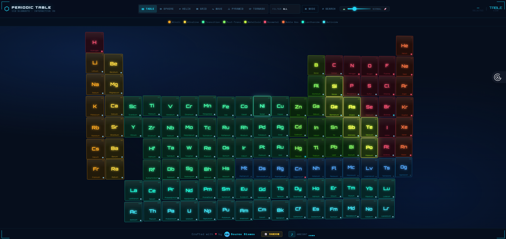
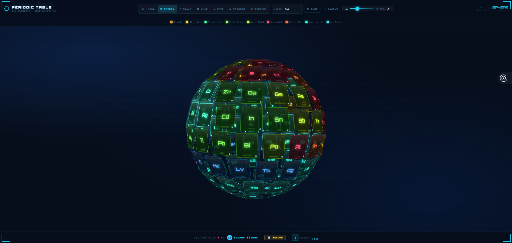

<div align="center">



<br/>
<br/>

# ⚛️ 3D Interactive Periodic Table

### *All 118 elements. Seven breathtaking layouts. One immersive experience.*

<br/>

[](https://3d-interactive-periodic-table-souravbiswas35.vercel.app/)
[](https://github.com/souravbiswas35/3D-Interactive-Periodic-Table/stargazers)
[](https://github.com/souravbiswas35/3D-Interactive-Periodic-Table/network/members)
[](LICENSE)
[](https://github.com/souravbiswas35)

<br/>

> **A pure vanilla JavaScript, zero-dependency 3D periodic table** with seven interactive 3D layouts,  
> real-time mouse parallax, and rich element detail panels —  
> crafted with love by [Sourav Biswas](https://github.com/souravbiswas35).

<br/>

</div>

---

## 📸 Preview

<div align="center">

| Table Layout | 3D Helix View |
|:---:|:---:|
|  |  |

</div>

---

## ✨ Features

### 🌌 Seven 3D Layouts
| Layout | Description | Tilt Range |
|--------|-------------|------------|
| **⊞ TABLE** | Classic 18×9 periodic table grid with parallax tilt | RotX 15° · RotY 20° |
| **◉ SPHERE** | Fibonacci-lattice sphere, all 118 cards on a ball | RotX 40° · RotY 360° |
| **⌀ HELIX** | DNA-style spiral — exact `radius=400, step=0.16` | RotX 30° · RotY 300° |
| **▦ GRID** | 5×5 layered depth grid, `colGap=150, depthGap=150` | RotX 10° · RotY 60° |
| **∿ WAVE** | 18-column ripple wave in 3D space, `amp=220` | RotX 20° · RotY 180° |
| **△ PYRAMID** | Expanding concentric rings, cards face outward | RotX 35° · RotY 200° |
| **⟳ TORNADO** | Tight-top wide-bottom vortex, `totalH=600` | RotX 15° · RotY 260° |

### 🎹 Element Interaction
- **Click any element** → expands in-place with atomic details (mass, density, melt/boil points, electron config, discovery, electronegativity)
- **Detail panel** → slides in with animated count-up atomic number, progress bars, and fun fact
- **← → ↑ ↓ arrow keys** → navigate between elements while panel is open
- **Panel PREV / NEXT buttons** → click to step through all 118 elements

### 🔍 Search & Filter
- **⌕ SEARCH** (or `Ctrl+K`) → instant search by name, symbol, or atomic number
- **FILTER dropdown** → isolate any of 9 element categories
- **Legend dot click** → triggers a 280ms group flash — matching elements ignite bright, then settle
- **Category flash** → all elements of the selected group pulse with `brightness(2.2)` glow


### 🃏 Other Features
- **🎲 RANDOM button** (or `R` key) — picks a random element and opens its detail panel
- **1–7 number keys** — instantly switch layouts
- **Escape** — close panel / search
- **◐ MODE** — dark ↔ light theme toggle
- **Floating bob animation** — table mode cards gently breathe with staggered sine-wave motion
- **Particle burst** on card expand — 10 flying dots in the card's own colour
- **Ripple effect** on every card click
- **Near-glow** in 3D modes — hovering a card makes same-family cards sympathetically glow
- **Semi-transparent 3D cards** (`opacity: 0.85`) — the whole 3D shape is visible through itself
- **Full mobile support** — swipe left/right to cycle layouts, pinch-to-zoom, bottom-sheet panel

---

## 🗂️ Project Structure

```
3D-Interactive-Periodic-Table/
│
├── index.html          # App shell — header, controls, scene, panel, search, footer
├── style.css           # All styles — dark/light mode, 7 layouts, card states, animations
├── script.js           # Pure vanilla JS — data, DOM, 3D math, music, interactions
│
└── assets/
    ├── P1.png          # Screenshot — Table layout
    └── P2.png          # Screenshot — Helix 3D layout
```

---

## 🚀 Getting Started

### Option 1 — Open directly (no server needed)
```bash
git clone https://github.com/souravbiswas35/3D-Interactive-Periodic-Table.git
cd 3D-Interactive-Periodic-Table
# Just open index.html in your browser
open index.html          # macOS
start index.html         # Windows
xdg-open index.html      # Linux
```

### Option 2 — Local dev server (recommended for best 3D performance)
```bash
# Using VS Code Live Server extension — click "Go Live"

# Or using Python
python -m http.server 5500
# Then open http://localhost:5500

# Or using Node.js
npx serve .
# Then open http://localhost:3000
```

> **No npm install. No build step. No dependencies.** Drop the three files anywhere and it runs.

---

## ⌨️ Keyboard Shortcuts

| Key | Action |
|-----|--------|
| `1` – `7` | Switch layout (1=Table … 7=Tornado) |
| `← → ↑ ↓` | Navigate elements (↑↓ jump a full row of 18) |
| `R` | Open a random element |
| `Ctrl` + `K` | Open search |
| `Esc` | Close panel / search |

---

## 🧬 Technical Highlights

### Zero Dependencies
No React. No Three.js. No Anime.js. No bundler. Every animation — including 3D transforms, parallax rotation, ambient music, and particle effects — is written in **pure vanilla JavaScript**.

### 3D Layout Mathematics
Each layout uses real 3D geometry:
- **Sphere** — Fibonacci lattice (`φ = acos(-1 + 2i/n)`) with `yaw + pitch` facing
- **Helix** — Parametric spiral (`x = r·sin(θ), z = r·cos(θ), θ_step = 0.16`)
- **Wave** — Sinusoidal Z-displacement over a flat 18-column grid
- **Pyramid** — Concentric rings with `outward_yaw = atan2(x, z)`
- **Tornado** — Expanding radius vortex (`r = 20 + (1-t)·320`)

### Music Engine
All seven ambient tracks are synthesised live using the Web Audio API:
- Pure **sine-wave oscillator** pads (3 detuned copies per note for warmth)
- Custom **convolution reverb** built from white-noise impulse buffers
- **Low-pass warmth filter** (`cutoff = 2800 Hz, Q = 0.5`)
- Slow **pentatonic melody** with bell-like envelope (fast attack, long exponential decay)
- Smooth crossfade between profiles on layout switch

### Animation Architecture
```
setLayout(name)
  ├── clearPendingTimeouts()       — cancel any in-flight stagger
  ├── collapseCard()               — restore 3D position from last3DPos[]
  ├── computePositions(name)       — pure math → [{x,y,z,ry,rx}]
  ├── save → last3DPos[]           — for expand/collapse restore
  ├── stagger(0..750ms random)     — opacity + transform transition per card
  ├── setTargetRot(x, y)           — start lerp loop (rate 0.018)
  ├── onLayoutChanged(name)        — start/stop float animation
  └── switchMusicProfile(name)     — crossfade audio
```

---

## 📦 Data

All 118 element records are stored as a flat array (stride = 9) directly in `script.js`:

```js
// [symbol, name, colorIdx, gridCol, gridRow, mass, density, melt, boil]
'H', 'Hydrogen', 0, 1, 1, 1.008, 0.09, -259, -253,
'He', 'Helium',  1, 18, 1, 4.003, 0.18, -272, -269,
// ... 116 more
```

Extended `INFO{}` object holds: category, phase (STP), electronegativity, electron configuration, discovery year/person, and a curated fun fact — for all 118 elements.

---

## 🎨 Design System

```css
/* 10 element colour families */
--c0: #ff5577  /* Nonmetals       — red    */
--c1: #ff7744  /* Noble Gas       — coral  */
--c2: #ffaa22  /* Alkali          — amber  */
--c3: #ffdd44  /* Alkaline Earth  — yellow */
--c4: #ccff44  /* Metalloids      — citrus */
--c5: #88ff66  /* Post-transition — lime   */
--c6: #44ffaa  /* Transition      — emerald*/
--c7: #22ffdd  /* Lanthanides     — teal   */
--c8: #44eeff  /* Actinides       — cyan   */
--c9: #55aaff  /* Unknown         — blue   */
```

Each colour family has four CSS custom properties: `--cX` (foreground), `--cXb` (border), `--cXd` (background), `--cXg` (glow) — giving every card a self-contained colour system inherited via `data-ci` attribute.

---

## 🤝 Contributing

Contributions, issues, and feature requests are warmly welcome!

```bash
# 1. Fork the repository
# 2. Create your feature branch
git checkout -b feature/amazing-feature

# 3. Commit your changes
git commit -m "feat: add amazing feature"

# 4. Push to the branch
git push origin feature/amazing-feature

# 5. Open a Pull Request
```

Please keep the **zero-dependency** philosophy — no npm packages, no bundlers, no framework imports.

---


## 🙏 Acknowledgements

- Element data sourced from IUPAC and public chemistry references
- Helix layout mathematics inspired by the original [Anime.js periodic table demo](https://animejs.com)
- Fibonacci sphere lattice algorithm — classical computer graphics technique
- Google Fonts: [Orbitron](https://fonts.google.com/specimen/Orbitron), [Space Mono](https://fonts.google.com/specimen/Space+Mono), [Rajdhani](https://fonts.google.com/specimen/Rajdhani)

---

<div align="center">

<br/>

**If this project sparked curiosity or joy, please consider giving it a ⭐**

<br/>


<br/>
<br/>

Crafted with ❤️ by **[Sourav Biswas](https://github.com/souravbiswas35)**

[](https://github.com/souravbiswas35)

<br/>

*"Chemistry is not just a science — it's the language of the universe."*

</div>
